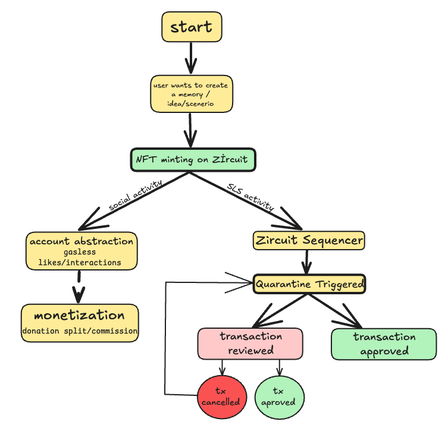

## Overview

People say memories last forever, but they can fade over time. Blockchain gives us a way to make them last forever, like a digital safe. Why not use this to save the most important things in our minds and on the chain? Every memory belongs to the person who lived it, and that’s where NFTs come in—they give you ownership. **Just like every book has a cover, every memory gets its own NFT to show it’s yours and keeps it special.**

People scroll through social media and see only perfect lives, which makes them feel unhappy with their own. But real life isn’t like that—full of ups and downs. They need a place where they can read and connect with real stories. Z-memo is here to fill that gap.

You might wonder, **“Why would people care to read or support someone else’s memories?”** Here are strong reasons that make Z-memo special:

Empathy & Human CuriosityPeople are naturally curious about others’ lives, choices, and feelings. Unlike made-up stories, real memories show the raw, honest side of life. This gives readers a chance to:

Feel empathy by connecting with someone else’s experience.
Learn new perspectives or life lessons.
Find inspiration to handle their own emotions.
as our motto: 


Zeynep is a social hub built to share and preserve real memories. Using Zircuit’s technology, we let creators mint unique NFTs from their personal memories (like a special day with a friend or a tough moment overcome). Others can like, bid on, or collaborate on these memories without the usual blockchain hassles, thanks to Zircuit’s fast and scalable tech.


## Features
- **NFT Minting for Memories**: Lets users turn their real memories—such as a special day with a friend or a personal challenge overcome—into unique, on-chain NFTs. Minted on the Zircuit blockchain, these NFTs represent exclusive digital ownership of life’s authentic moments.
- **Scalability on Layer2**: All actions will take place on Layer2, providing low cost and high speed. In this way, the user experience will be smoothly executed.
- **Account Abstraction for gassless UX**: Enable gasless likes and interactions using Zircuit’s account abstraction tech.
- **Protection with Zircuit Quarantine Layer**: Automatically quarantine and cancel suspicious transactions (e.g., spam or theft attempts) using Zircuit’s SLS.
- **Monetization**: Allow users to bid on or donate to NFTs, fostering a creator economy.
- **Privacy with ZK-Proofs**: Use Zircuit’s zero-knowledge proofs to protect sensitive content while proving ownership.

## How It Works


### 1. Minting an NFT
- A user inputs a thought (e.g., "Movie idea: Time-traveling chef") or memory (e.g., "Trip with friend X") via a simple interface.
- The content is minted as an NFT on Zircuit, linked to the creator’s wallet.
- Example: `nft.mint("Time-traveling chef", creatorAddress)`.

### 2. Account Abstraction
- Users can like or interact with NFTs without paying gas fees, thanks to Zircuit’s account abstraction.
- Transactions are batched, reducing costs for end-users.

### 3. Quarantine Mechanism
- Suspicious transactions (e.g., rapid minting or unauthorized access) are managed by Zircuit’s sequencer.
- Prove it is not the same person to deploy the ownership and cancel the tx 

### 4. Monetization & Collaboration
- Others can bid on NFTs (e.g., "Offer 0.1 ETH for movie idea") or donate.
- Creators and co-creators (e.g., friend X) split proceeds.

## Tech Stack
- **Blockchain**: Zircuit (zkRollup testnet)
- **Smart Contracts**: Solidity
- **Frontend**: React.js
- **Account Abstraction**: Zircuit’s native support
- **ZK-Proofs**: Zİrcuit Roll_up (circom for demo)
- **Testing**: Zircuit testnet

## Installation
1. Clone the repo:
   ```bash
   git clone https://github.com/yourusername/ThoughtNFT-Zircuit.git
